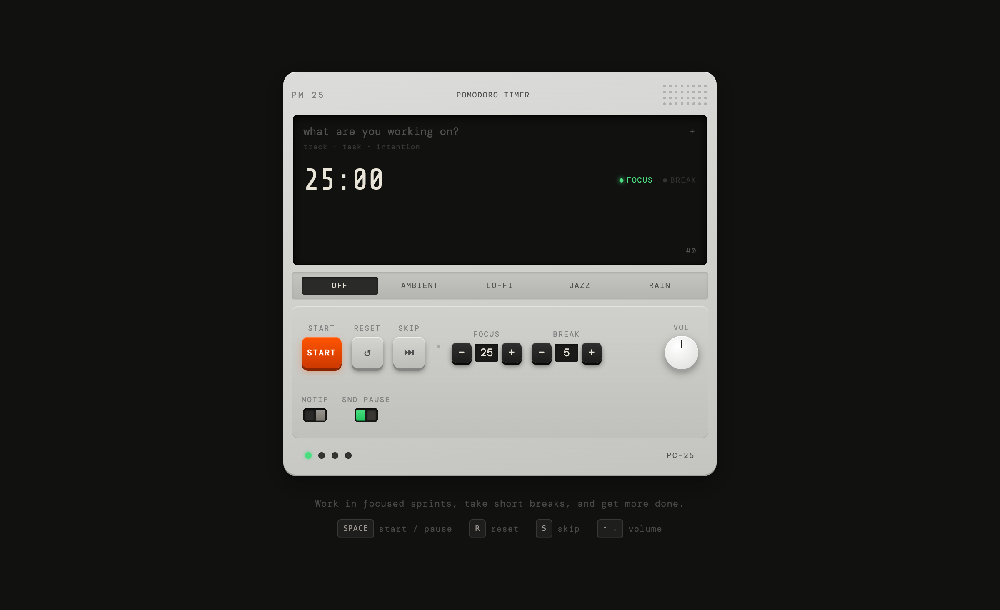

# PM-25 Pomodoro Timer

A Pomodoro timer that feels like a physical instrument. Inspired by [Teenage Engineering](https://teenage.engineering/) hardware — rendered as a fixed-width device in the browser.



## Features

- **Hardware aesthetic** — fixed 480px device body with LCD display, tactile buttons, rocker toggles, and a volume knob
- **Drift-proof timer** — uses `Date.now()` end-time anchoring instead of naive interval counting
- **4 ambient sound modes** — Ambient, Lo-Fi, Jazz, and Rain backgrounds while you work
- **16 synthesized UI sounds** — every interaction has audio feedback via Web Audio API
- **Task queue** — track what you're working on, auto-advances when a focus session completes
- **Session tracking** — 4-session cycles with long break after every 4th focus
- **Browser notifications** — optional alerts when phases change
- **Pause sound on break** — toggle to silence ambient audio during breaks
- **Keyboard shortcuts** — `Space` start/pause, `R` reset, `S` skip, `↑↓` volume
- **Session persistence** — timer state snapshots to localStorage every 5s, restores on reload
- **Tab visibility handling** — pauses/resumes ambient audio when you switch tabs

## Getting Started

```bash
git clone https://github.com/gagankg/pomodoro-web.git
cd pomodoro-web
npm install
npm run dev
```

Open [http://localhost:5173](http://localhost:5173) in your browser.

## Build

```bash
npm run build
npm run preview
```

## Stack

- React 18 (Vite)
- Tailwind CSS (layout only)
- CSS custom properties (all surface aesthetics)
- Web Audio API (UI sounds + ambient playback)
- localStorage (settings + session persistence)

## Audio Credits

Ambient tracks sourced from [Pixabay](https://pixabay.com/) (royalty-free):

- **Ambient** — "Caves of Dawn" by guilhermebernardes
- **Lo-Fi** — "Lo-Fi Ambient Music with Gentle Rain Sounds" by desifreemusic
- **Jazz** — "Restaurant Jazz Cafe Music" by tatamusic
- **Rain** — "Sleepy Rain" by lorenzobuczek

## License

[MIT](LICENSE)
